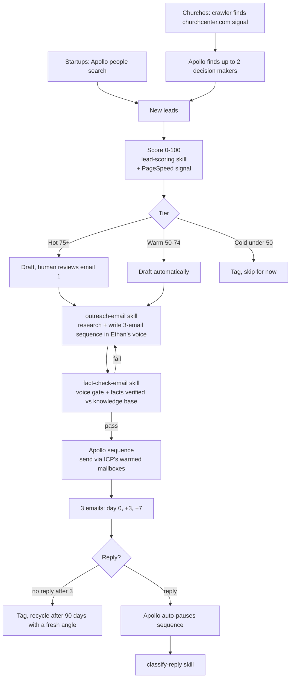
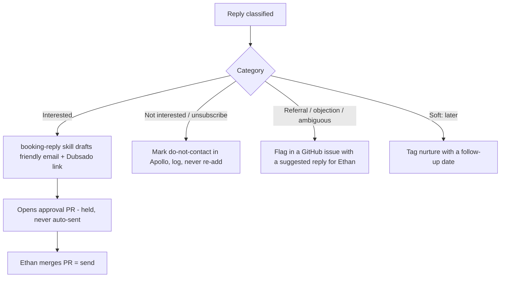
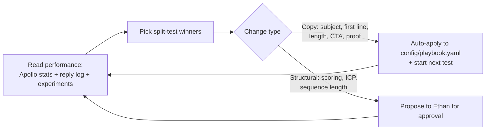
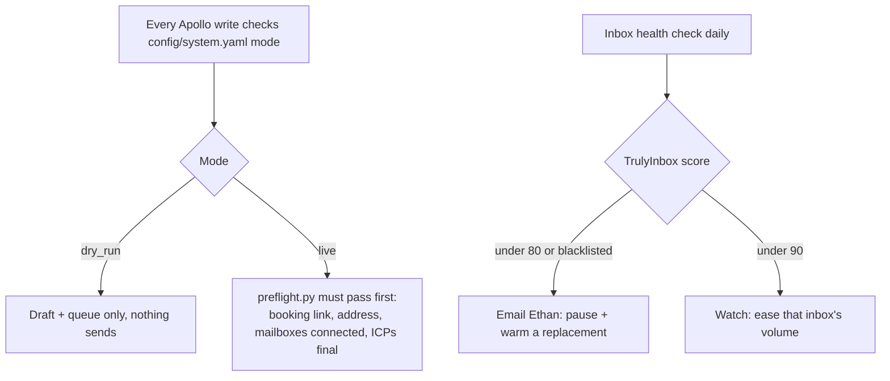

# Polymer Outreach — Tech Stack & How It Works

A plain-language map of the system for sanity-checking and for handing to a designer to
visualize. The Mermaid diagrams below render on GitHub automatically.

## The tech stack (who does what)

| Layer | Tool | Job |
|---|---|---|
| Brain | **Claude** (via GitHub Actions + the Claude Code Action) | Scores leads, researches companies, writes emails, fact-checks them, classifies replies, runs the biweekly review |
| Lead data + sending + CRM | **Apollo** | Finds startup leads, holds all contacts, sends every cold email through connected mailboxes, detects replies |
| Church lead sourcing | **Custom crawler** (`scripts/church_crawler.py`) | Finds churches via the Planning Center / churchcenter.com signal (Apollo's church data is thin) |
| Mailbox warmup + deliverability | **TrulyInbox** | Warms the sending inboxes; the health API feeds the failsafe monitor |
| Site-quality signal | **Google PageSpeed** | Scores each lead's website speed/mobile health (`scripts/pagespeed.py`) → feeds the technographic score and gives the email its first-line load-time hook |
| Internal alerts to Ethan | **Resend** | Emails Ethan inbox-health alarms and reply flags. Never sends sales email |
| Scheduler + system of record | **GitHub Actions + this repo** | Runs the jobs on cron; the repo is the audit trail (leads, drafts, reports, logs) |

**Sending, said once clearly:** every cold email (both ICPs) goes out through **Apollo's
sequencer**, sending through your **TrulyInbox-warmed mailboxes** connected to Apollo by OAuth
(not Apollo's shared servers). Startups send from `launchwithpolymer.com`, churches from
`integratedchurchwebsites.com`. Resend is only for alerts to you.

## The main pipeline

## What happens when someone replies

## The self-improvement loop (every 2 weeks)

## The safety rails (always on)

## One-line summary

Apollo and a church crawler find the right 2 people per org, Claude scores and writes a
researched 3-email sequence in Ethan's voice, a fact-check gate blocks anything off-voice or
unverified, Apollo sends it through warmed inboxes, replies route to a booking link (you
approve by merging a PR), and every two weeks the system A/B-tests itself and keeps what wins.
